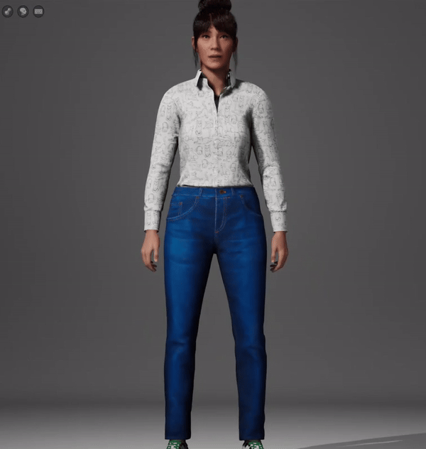

# Documentação semana 2 - Experiências Imersivas

## Estrutura de pastas

Segue a estrutura de arquivos atual do diretório:

```
├── assets
│    ├── barbara_intro.mp3
│    ├── interao_mapa.gif
│    ├── MetaHuman_Barbie_face.gif
│    ├── MetaHumanCreator_Body.gif
│    ├── video_final.mp4
│
├── src
│    ├── Barbara.mhb
│
├── README.md
```

-   Barbara.mhb: Arquivo .mhb da personalização do Avatar.
-   barbara_intro.mp3: Audio gerado para integração com Avatar.
-   video_final.mp4: Video Final da demo desenvolvida.
-   interao_mapa.gif: Video da interação do ambiente em que o Avatar foi integrado.
-   MetaHuman_Barbie_face.gif: Video com demonstração da facial do Avatar.
-   MetaHumanCreator_Body.gif: Video com demonstração do corpo do Avatar.
-   readme.md: Documentação oficial do projeto.

## Introdução

Antes de iniciar, no desenvolvimento do humano virtual Bárbara, foram utilizadas três tecnologias principais:

- **MetaHuman Creator:** Ferramenta da Epic Games que permite a criação de humanos digitais com altíssimo realismo e personalização. Com ela, foi possível definir a aparência da Bárbara, ajustando detalhes como traços faciais, textura de pele e expressões para refletir sua personalidade acolhedora e amigável.

- **ElevenLabs:** Plataforma avançada de text-to-speech utilizada para gerar o áudio das falas de Bárbara. Sua capacidade de criar vozes naturais e emocionais garantiu uma comunicação clara e empática, essencial para estabelecer uma conexão mais humanizada com os usuários.  

- **Unreal Engine:** Ambiente de desenvolvimento que integrou todos os elementos do projeto, desde a modelagem e animação do avatar até a criação do cenário virtual. Foi utilizado o MetaHuman Animator para sincronizar expressões faciais com o áudio, além de ajustes no blueprint para implementar a interatividade e as animações no ambiente.

## Processo de desenvolvimento

O humano virtual da Bárbara foi projetado com o propósito de transformar a experiência de compra em uma loja de roupas virtuais, oferecendo aos clientes uma interação personalizada e intuitiva. A sua principal função é atuar como uma assistente digital capaz de auxiliar os usuários na criação de avatares com corpos realistas e identificavéis, na experimentação virtual de roupas e na descoberta de combinações de peças que reflitam o estilo e as preferências individuais. A Bárbara não será apenas uma assistente, mas também uma figura amigável, acolhedora e prática, criada para tornar o processo de compra mais confortável e acessível.


A plataforma que a Bárbara será implementada será acessível em dispositivos com sistemas de realidade aumentada ou virtual. O público-alvo inclui consumidores que desejam explorar novas possibilidades de estilo ou que buscam testar roupas virtualmente antes de realizar uma compra. A experiência promovida por Bárbara destaca-se pela abordagem empática e pela capacidade de personalização, características essenciais para criar uma conexão significativa com os usuários.

Bárbara foi desenvolvida com uma personalidade que combina empatia, estilo e eficiência. Ela deve acolhe os clientes com uma abordagem amigável, é sempre atualizada com as tendências de moda e se comunicar de forma clara e direta, garantindo que cada interação seja objetiva e funcional. Suas funções são variadas: ela orienta os usuários na criação de seus avatares, simulando o uso das roupas no corpo criado, e sugere combinações personalizadas com base nos dados fornecidos pelo cliente e nas tendências atuais.

O cenário de uso prático é simples e eficiente. Ao acessar a loja virtual, o cliente é guiado por Bárbara em todas as etapas do processo, desde a criação corporal virtual até a escolha das roupas. Ela também está disponível para responder a perguntas sobre ajuste, estilo e tendências, agindo como uma consultora de moda que torna o processo de compra mais interativo e personalizado.

A aparência da Bárbara foi projetada para refletir o contexto da aplicação. Ela veste roupas casuais e modernas, como uma camisa estampada de estilo descontraído e calça jeans, transmitindo conforto e acessibilidade. A escolha do vestuário reflete sua função como uma "amiga estilista", e não como uma funcionária formal. Seus traços faciais amigáveis, combinados com um sorriso leve e acolhedor, reforçam essa ideia de proximidade e empatia. O penteado moderno e casual, com franja, foi criado para complementar a aparência geral, enquanto os tons neutros escolhidos para suas roupas promovem uma conexão visual agradável e sem exageros.



O processo de criação de Bárbara no MetaHuman Creator foi detalhado para o contexto. Inicialmente, foi selecionado um modelo-base adequado ao propósito e ajustados elementos como proporções corporais, idade e traços faciais para atingir o equilíbrio perfeito entre realismo e ambiente virtual. Suas expressões faciais foram configuradas para transmitir simpatia, evitando exageros que poderiam comprometer sua naturalidade. Detalhes do vestuário, como as texturas da camisa e da calça jeans, foram trabalhados para reforçar o nível de realismo, garantindo uma aparência profissional e moderna.

O processo de idealização das animações de Bárbara foi feito para garantir uma interação natural e envolvente com os usuários. Para isso, foi tido como objetivo o foco em transmitir a personalidade acolhedora e amigável definida para Bárbara. A interação começa com uma introdução calorosa de Bárbara, que utiliza animações corporais sincronizadas com sua voz para criar uma experiência mais realista e imersiva. O texto de apresentação, gerado com o apoio de uma ferramenta de IA generativa, foi estruturado da seguinte forma:

*"Olá! Eu sou a Bárbara, sua assistente virtual aqui na nossa loja de roupas no mundo virtual. Estou aqui para ajudar você a encontrar o look perfeito sem sair de casa! Nossa tecnologia permite que você experimente virtualmente qualquer peça da loja, criando um avatar que se parece com você. Assim, você pode ver como as roupas caem antes de comprar. É como ter o provador da loja na sua sala! Fique à vontade para me pedir ajuda. Posso sugerir combinações, ajustar medidas no avatar e até mostrar as últimas tendências. Vamos começar a montar seu estilo único?"*  

O áudio desse texto foi gerado com a IA de text-to-speech Eleven Labs, escolhida pela sua qualidade natural de voz e variação de tons para reforçar a proximidade emocional com o usuário.

As animações de Bárbara foram obtidas na loja Fab da Unreal Engine, todas gratuitas e adaptadas ao propósito do projeto. As três animações escolhidas foram:

- **Idle:** Animação de inatividade, onde Bárbara permanece em uma postura relaxada, transmitindo calma e atenção ao cliente enquanto não há interação.
- **Cumprimentos:** Animação em que Bárbara acena com as mãos ao iniciar uma fala, reforçando sua atitude calorosa e receptiva.
- **Parabenização:** Animação de Bárbara batendo palmas ao final da interação, como uma forma de celebrar o sucesso do processo e reforçar uma experiência positiva para o usuário.  

Somente a animação de Cumprimentos foi sincronizada com o áudio utilizando ferramentas disponíveis na Unreal Engine, garantindo que os movimentos corporais estivessem sendo realizados enquanto ela estivesse em fala.

Antes da exportação do avatar foi criado um ambiente virtual com o objetivo de deixar o usuario mais confortável. Esse ambiente foi projetado para se assemelhar a uma casa minimalista, com quase todos os elementos em branco para evitar distrações e manter o foco nas roupas. A simplicidade do cenário remete a um espaço confortável e familiar, ajudando o usuário a se sentir à vontade durante a interação.


Após isso, o blueprint do MetaHuman foi ajustado para incorporar a interatividade desejada. Quando o usuário inicia uma interação por teclado ou controle de realidade virtual, o avatar executa automaticamente a animação de cumprimentos acompanhada da fala. Após concluir a interação, Bárbara executa a animação de parabenização como um gesto final de celebração e encerramento.

O áudio gerado foi importado para o Unreal Engine e sincronizado a animação de cumprimentos da Bárbara. A animação "Cumprimentos" foi configurada para ser ativada automaticamente junto com a introdução vocal, enquanto a animação "Parabenização" foi programada para ser exibida ao final da interação, criando um ciclo completo e envolvente para o usuário.  

Com essas etapas concluídas, foi registrado um video do processo final:

https://github.com/user-attachments/assets/b82a702a-f4e3-4c9a-8b99-dbfa01c6c0f6


